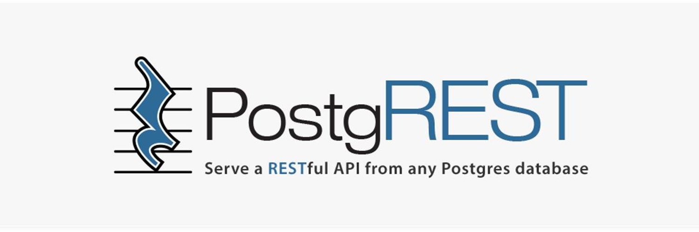

# PostgREST Railway

## PostgREST - a standalone web server that turns your PostgreSQL database directly into a RESTful API.

This is a [Railway](https://railway.app/)-focused deployment implementation of [PostgREST](https://postgrest.org/).

Use the **Deploy to Railway** button above to launch PostgREST on Railway. When deploying, make sure to check all configuration options and adjust them to your needs. It's especially important to set `PGRST_JWT_SECRET` to a random secure value. 

Refer to the [PostgREST Docker tutorial](https://postgrest.org/en/stable/install.html#docker) for more information.
